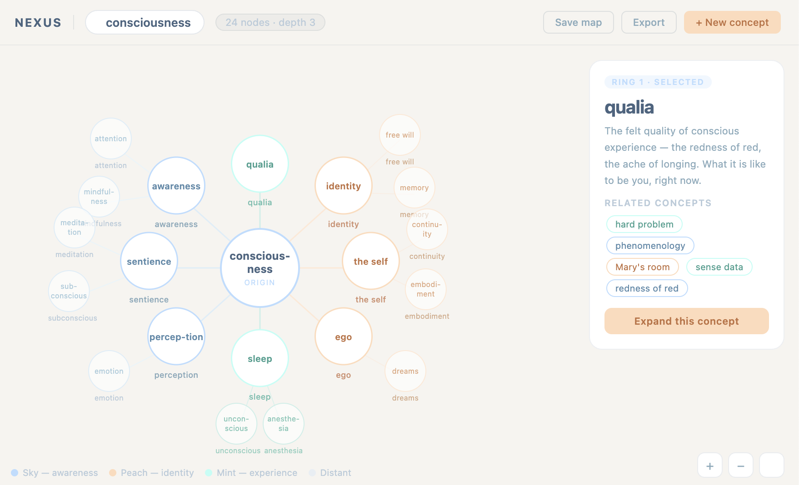

# bloom

Type any word. Watch it bloom into a map of connected ideas.



An infinite concept exploration tool powered by Claude AI — every click re-centres the universe around a new idea. No accounts, no history, just pure exploration.

**Status:** Phase 1 — Foundation (in progress)  
**Live:** not yet deployed

---

## Quick start

```bash
cp .env.example .env.local
# Add your ANTHROPIC_API_KEY to .env.local

npm install
npm run dev
```

Full setup: see [`.claude/setup.md`](.claude/setup.md)

---

## Stack

- Next.js 15 (app router)
- D3.js — force-directed graph
- Anthropic claude-sonnet-4 — streaming concept expansion
- TypeScript strict mode
- Vitest + React Testing Library

---

## Development

```bash
npm run dev          # start dev server
npm run type-check   # TypeScript check
npm test             # run tests
npm run build        # production build
```
